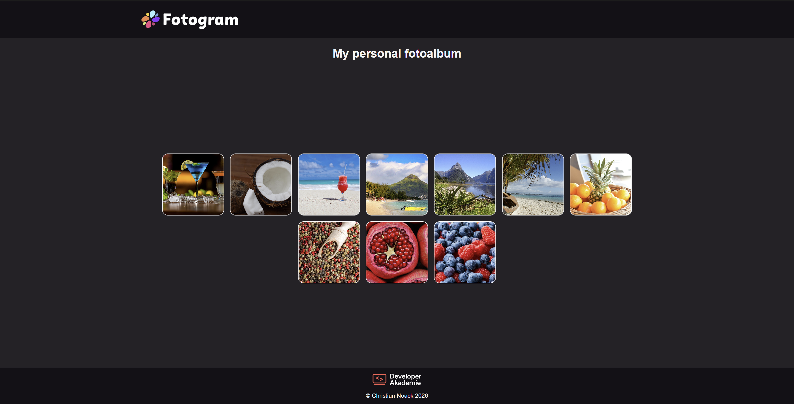

# 📸 Fotogram  

Responsive social media web application built with HTML, CSS and JavaScript.  
Developed as part of the **Developer Akademie** Fullstack training program.
Coded by Christian Noack

---

## 🚀 Tech Stack


---

## 📌 Overview

Fotogram is a responsive social media style web application.

The project focuses on:

- Dynamic content rendering with JavaScript  
- Structured component-based layout  
- Clean separation of HTML, CSS and JS  
- Responsive design for mobile and desktop  
- Interactive UI elements  
- Reusable logic functions  

The application simulates core social media functionality such as posts, likes and comments.

---

## 🎯 Features

- Social media post layout  
- Like functionality  
- Comment functionality  
- Dynamic content updates  
- Responsive navigation  
- Structured folder organization  
- Clean visual hierarchy  
- Mobile-first design approach  

---

## 🧠 Learning Goals

This project was built to practice:

- DOM manipulation  
- Event handling  
- Data-driven rendering  
- Modular JavaScript structure  
- UI interaction logic  
- Responsive layout techniques  
- Debugging and code organization  

---

## 🖥 Preview

Example:



---

## ⚙ Installation

```bash
git clone https://github.com/ChrisNo86/fotogram.git
cd fotogram
open index.html
